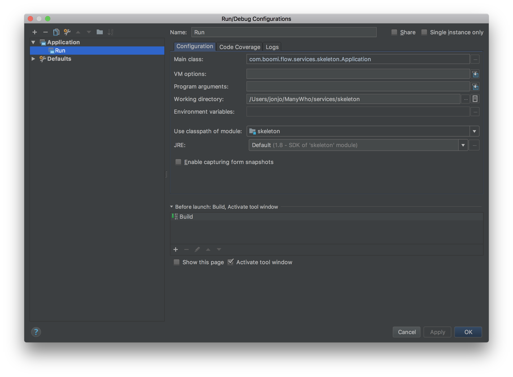

Getting Started
===============

We've created a super-basic, skeleton service for you to get started building right away! It's available on our GitHub, [right here](https://github.com/manywho/service-skeleton), and running it will give you a working service.

It's not very helpful in its skeleton form, so you'll need to add features to it depending on the bits your service will need. We have documentation on adding the following parts, which should get you 90% of the way to where you want to go, but if there's anything missing then feel free to [open an issue](https://github.com/manywho/sdk-java/issues/new) on the repo or ask a question in our [Gitter community](https://gitter.im/manywho/sdk-java) - we're friendly!

* [Configuration](features/configuration.md)
* [Database](features/database.md)
* [Files](features/files.md)
* [Identity](features/identity.md)
* [Listeners](features/listeners.md)
* [Message Actions](features/message-actions.md)
* [Social](features/social.md)
* [Types](features/types.md)

### Running

The skeleton service is super-easy to run, as long as you have Maven and a Java 8 JDK installed (OpenJDK 8 is recommended). Simply run the `Application.main` method and you'll be away:

